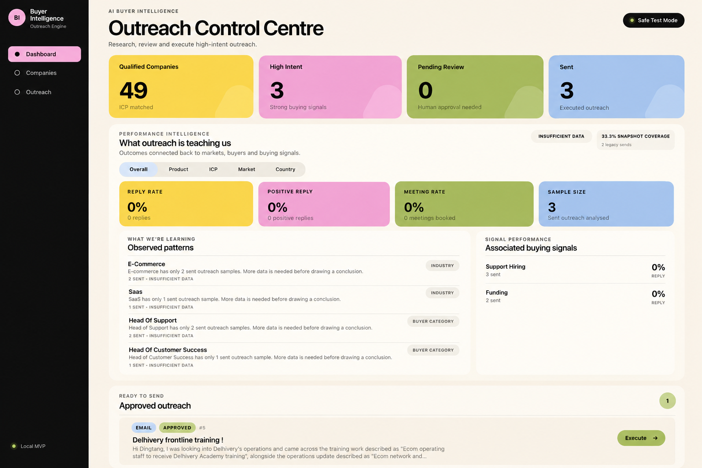
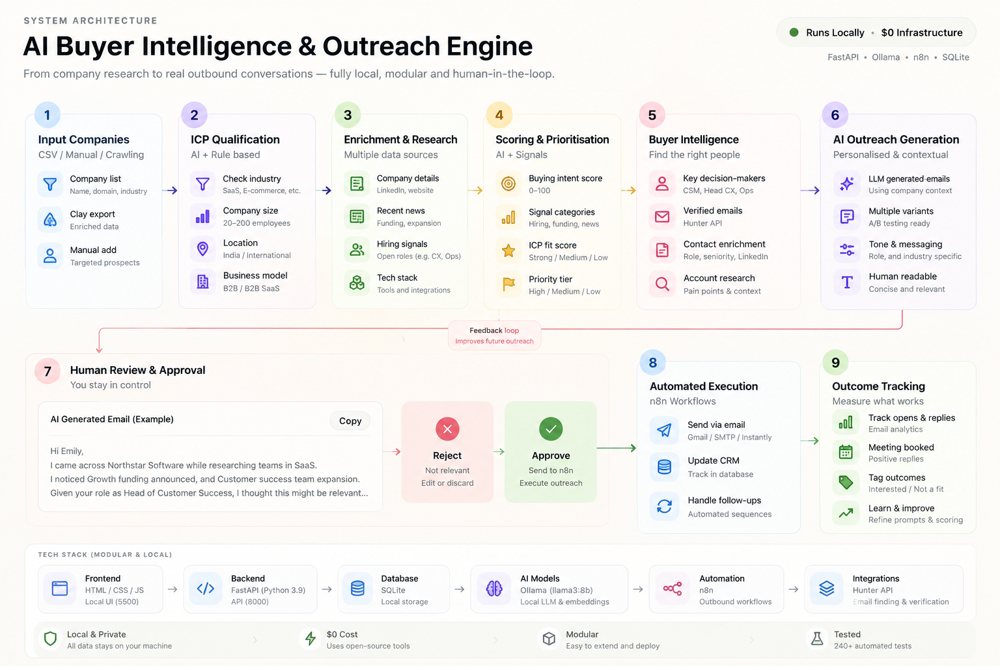
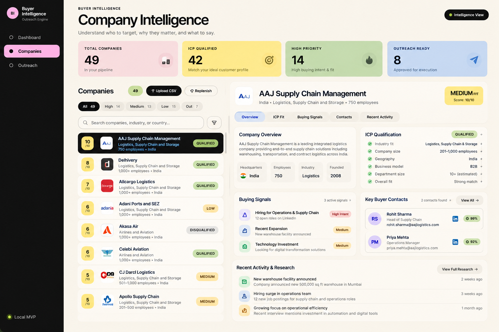
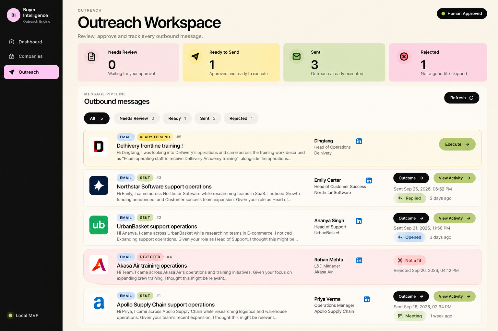

# AI Buyer Intelligence & Outreach Engine

An end-to-end AI-assisted outbound intelligence system that discovers target companies, evaluates ICP fit and buying signals, identifies relevant decision-makers, researches accounts, generates personalised outreach, routes messages through human approval, executes approved outreach, and learns from campaign outcomes.

Built as a portfolio project demonstrating **AI engineering, workflow automation, backend architecture, human-in-the-loop systems, and production-style testing**.

---

## The Problem

Traditional outbound prospecting often involves several disconnected manual steps:

1. Define an Ideal Customer Profile (ICP)
2. Find companies matching that ICP
3. Research each company
4. Identify relevant buyers
5. Look for buying signals
6. Prioritise accounts
7. Write personalised outreach
8. Review messages
9. Send outreach
10. Track results
11. Learn what works

This system combines those steps into one structured intelligence and automation pipeline while keeping a human in control of outbound execution.

---


### Outreach Control Centre

The control centre brings qualified accounts, buying intent, outreach status and performance intelligence into one operational view.



## System Workflow

```text
Product
   ↓
ICP Definition
   ↓
Company Discovery
   ↓
Company Qualification
   ↓
Company Enrichment
   ↓
Signal Discovery
   ↓
ICP + Signal Scoring
   ↓
Buyer Discovery & Ranking
   ↓
Account Research
   ↓
AI Outreach Generation
   ↓
Human Review
   ↓
Approve / Reject
   ↓
Outreach Execution
   ↓
Outcome Tracking
   ↓
Performance Learning
```

The system separates **research, reasoning, review and execution**, rather than allowing an AI model to send messages autonomously.

---


### End-to-End Architecture

The pipeline separates qualification, research, AI reasoning, human approval, execution and performance learning.



## Core Features

### ICP Intelligence

Define and manage Ideal Customer Profiles using criteria such as:

- industry
- company size
- geography
- business model
- target buyer roles

Companies can then be evaluated against those criteria before entering the outreach pipeline.

### Company Discovery & Qualification

The system can ingest or discover companies and determine whether they match the active ICP.

Qualification logic prevents obviously irrelevant accounts from progressing further through the workflow.

### Company Enrichment

A provider-based enrichment layer allows additional company information to be collected without tightly coupling the application to one external data source.

### Buying Signal Intelligence

Signals can be discovered, stored and scored to identify evidence that an account may be relevant for outreach.

Signal information can contribute to overall company prioritisation.

### Company Scoring

Accounts are prioritised using structured signals such as:

- ICP fit
- company characteristics
- buyer relevance
- available evidence
- buying signals

This helps separate high-priority accounts from lower-confidence prospects.

### Buyer Intelligence

The system identifies potential decision-makers and ranks them according to their relevance to the target problem and ICP.

This prevents outreach from simply targeting any available contact.

### Account Research

Research is consolidated into structured account intelligence that can be used during outreach generation.

This allows generated messages to reference actual account evidence rather than relying entirely on generic AI copy.

### AI Outreach Generation

The outreach generation layer uses account intelligence, buyer information and available evidence to generate contextual outbound messages.

The LLM layer is provider-based so the AI implementation can be changed without rewriting the core business logic.

### Human-in-the-Loop Review

Generated outreach is **not automatically sent**.

Messages enter a review workflow where a human can:

- inspect the generated message
- approve it
- reject it
- control whether execution occurs

This provides a safety boundary between AI generation and external actions.

### Outreach Execution

Approved messages can be passed through an execution provider.

The architecture supports workflow tools such as **n8n** while keeping execution separate from message generation.

### Outcome Tracking

The system records outreach outcomes and attribution information so campaign activity can be analysed later.

### Performance Learning

Campaign outcomes can be aggregated into performance intelligence.

This creates a feedback loop:

```text
Research
   ↓
Generate
   ↓
Review
   ↓
Execute
   ↓
Measure
   ↓
Learn
   ↓
Improve future prioritisation
```

### Company Replenishment

The system includes a replenishment workflow so new companies can continuously enter the intelligence pipeline instead of relying on a static lead list.

---


### Company Intelligence

Accounts are evaluated against the ICP, enriched with relevant context, prioritised using fit and buying signals, and connected to relevant buyers.



## Architecture

The backend follows a layered architecture:

```text
API Layer
    ↓
Workflow Layer
    ↓
Service Layer
    ↓
Provider Layer
    ↓
Repository Layer
    ↓
SQLite
```

### API Layer

FastAPI endpoints expose functionality for:

- products
- ICPs
- companies
- campaigns
- outreach

### Workflow Layer

Multi-step business processes are coordinated through dedicated workflows including:

- company intelligence
- company enrichment
- company signals
- buyer intelligence
- account intelligence
- outreach generation
- company replenishment

### Service Layer

Business logic is separated into focused services for:

- company qualification
- company scoring
- buyer ranking
- buyer relevance
- signal scoring
- outreach generation
- outreach review
- outreach execution
- outcome tracking
- performance analysis

### Provider Layer

External capabilities are abstracted behind providers.

Current provider categories include:

```text
providers/
├── contacts/
├── discovery/
├── enrichment/
├── execution/
├── llm/
└── signals/
```

This makes external integrations replaceable without tightly coupling them to core business logic.

### Repository Layer

Persistence is handled through repositories rather than direct database access throughout the application.

Repositories exist for entities including:

- products
- ICPs
- companies
- company scores
- contacts
- signals
- account research
- campaigns
- outreach
- outcomes
- attribution snapshots
- performance data

---

## Human-in-the-Loop Design

A major design decision was separating:

```text
AI GENERATION
      ↓
HUMAN REVIEW
      ↓
EXTERNAL EXECUTION
```

Generating a message does not automatically trigger an external action.

The execution workflow only operates after the outreach has entered the appropriate approved state.

This pattern is useful for AI systems where autonomous actions could have real-world consequences.

---


### Human-in-the-Loop Outreach

AI-generated messages remain under human control: review, approve or reject, execute approved outreach, and track outcomes.



## Tech Stack

**Backend**

- Python
- FastAPI
- Pydantic
- SQLite

**AI**

- Local LLM support
- Ollama
- Provider-based LLM architecture

**Automation**

- n8n-compatible execution workflow

**Frontend**

- HTML
- CSS
- Vanilla JavaScript

**Testing**

- pytest
- 240 automated tests

---

## Project Structure

```text
Lead Intelligence/
├── app/
│   ├── api/
│   ├── db/
│   ├── models/
│   ├── providers/
│   ├── repositories/
│   ├── schemas/
│   ├── services/
│   ├── workflows/
│   ├── config.py
│   └── main.py
│
├── frontend/
│   ├── css/
│   ├── js/
│   └── index.html
│
├── scripts/
│   ├── seed_demo_data.py
│   └── test_live_n8n_outreach.py
│
├── tests/
├── .env.example
├── .gitignore
├── requirements.txt
└── README.md
```

---

## Running Locally

### 1. Clone the repository

```bash
git clone <YOUR_REPOSITORY_URL>
cd <YOUR_REPOSITORY_FOLDER>
```

### 2. Create a virtual environment

```bash
python3 -m venv .venv
source .venv/bin/activate
```

### 3. Install dependencies

```bash
pip install -r requirements.txt
```

### 4. Configure environment variables

Copy:

```text
.env.example
```

to:

```text
.env
```

Then configure any integrations you want to use.

Never commit the real `.env` file.

### 5. Seed demo data

```bash
python scripts/seed_demo_data.py
```

### 6. Start the API

```bash
python -m uvicorn app.main:app --reload --port 8000
```

API documentation:

```text
http://127.0.0.1:8000/docs
```

### 7. Start the frontend

Open another terminal:

```bash
python -m http.server 5500 --directory frontend
```

Then open:

```text
http://127.0.0.1:5500
```

---

## Running Tests

Run:

```bash
pytest -q
```

Current test suite:

```text
240 passed
```

The tests cover areas including:

- database schema
- products
- ICP lifecycle
- company discovery
- company qualification
- company scoring
- enrichment
- signals
- buyer discovery
- buyer ranking
- account research
- outreach generation
- human review
- execution
- campaigns
- outcome tracking
- attribution
- performance intelligence
- replenishment workflows

---

## Demo Flow

A simple demonstration can follow this sequence:

```text
1. Define Product
        ↓
2. Define ICP
        ↓
3. Discover / Import Companies
        ↓
4. Qualify Companies
        ↓
5. Analyse Signals
        ↓
6. Rank Accounts
        ↓
7. Identify Buyers
        ↓
8. Generate Account Research
        ↓
9. Generate Personalised Outreach
        ↓
10. Human Reviews Message
        ↓
11. Approve / Reject
        ↓
12. Execute Approved Outreach
        ↓
13. Record Outcome
        ↓
14. Analyse Performance
```

---


## System Architecture

The system separates deterministic business logic, AI reasoning and external execution so generated actions remain observable and human-controlled.

---

## Engineering Decisions

### Why use provider abstractions?

External services change frequently.

Separating discovery, enrichment, contacts, signals, execution and LLM functionality behind provider interfaces makes the system easier to extend or replace.

### Why separate workflows and services?

Services contain focused business logic.

Workflows coordinate multiple services to complete larger operations.

This prevents large endpoint functions from becoming responsible for the entire application.

### Why human approval?

LLMs are useful for research and generation, but outbound communication is an external action.

The system therefore treats:

**generation ≠ permission to execute.**

### Why local AI support?

Local LLM support makes it possible to experiment with AI workflows without requiring every development request to use a paid model API.

---

## What This Project Demonstrates

This project was built to explore engineering patterns required for practical AI automation systems:

- multi-step AI workflows
- structured LLM outputs
- deterministic business rules around AI
- provider abstractions
- human-in-the-loop execution
- persistent workflow state
- external automation integration
- evidence-based personalisation
- outcome attribution
- feedback loops
- automated testing

The goal is not simply to generate cold emails.

The goal is to demonstrate how an AI system can move from **raw account data → structured intelligence → controlled action → measurable outcomes**.

---

## Future Improvements

Potential extensions include:

- additional enrichment providers
- live CRM integration
- asynchronous background jobs
- production authentication
- PostgreSQL persistence
- hosted deployment
- additional LLM providers
- campaign experimentation
- richer observability
- automated signal monitoring

---

## Status

**Portfolio / engineering demonstration**

Core workflows are implemented and covered by an automated test suite.

Current test status:

**240 tests passing.**
